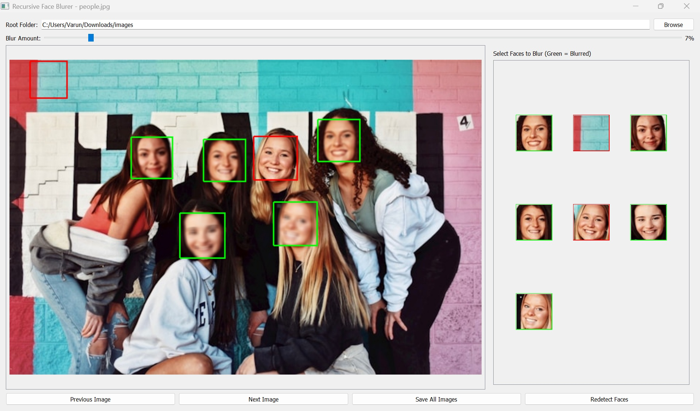

# Face Blurring Application



A PyQt5-based application for detecting and blurring faces in images recursively through folders. The application provides an intuitive interface for selecting which faces to blur and adjusting the blur intensity.

## Features

- **Recursive folder scanning**: Processes all images in a folder and its subfolders
- **Face detection**: Uses OpenCV's Haar cascade classifier
- **Interactive face selection**: 
  - Visual grid of detected faces
  - Green border = face will be blurred
  - Red border = face will remain unblurred
- **Real-time preview**: See blur effects immediately
- **Adjustable blur intensity**: Global slider controls blur amount for all images
- **Image navigation**: Move between images with Next/Previous buttons
- **Batch processing**: Save all images with one click
- **State preservation**: Remembers selections as you navigate between images
- **Multiple format support**: Works with JPG, PNG, BMP, and WebP formats

## Requirements

- Python 3.6+
- OpenCV (`opencv-python`)
- PyQt5
- Pillow (PIL)

## Installation

1. Clone the repository:
   ```bash
   git clone https://github.com/varunrao1991/face-blurring-app.git
   cd face-blurring-app
   ```

2. Install the required packages:
   ```bash
   pip install -r requirements.txt
   ```

   Or install them manually:
   ```bash
   pip install opencv-python PyQt5 Pillow
   ```

## Usage

1. Run the application:
   ```bash
   python face_blurrer.py
   ```

2. Select a root folder containing your images using the "Browse" button

3. Adjust the blur amount using the slider (higher values = more blur)

4. Select/deselect faces to blur by clicking on the face thumbnails:
   - Green border: Face will be blurred
   - Red border: Face will remain clear

5. Navigate between images using the "Next" and "Previous" buttons

6. When ready, click "Save All Images" to overwrite the originals with blurred versions

## Command Line Options

You can optionally specify a folder path when launching the application:
```bash
python face_blurrer.py /path/to/your/images
```

## How It Works

1. The application scans the selected folder recursively for image files
2. For each image, it detects faces using OpenCV's Haar cascade classifier
3. You can select which faces to blur by clicking their thumbnails
4. The blur is applied in real-time using Gaussian blur
5. When saving, the application preserves the original image format

## Known Limitations

- Face detection may not be perfect (may miss some faces or detect false positives)
- WebP support requires Pillow library
- Very large images may affect performance

## Contributing

Contributions are welcome! Please open an issue or submit a pull request for any improvements.

## License

This project is licensed under the MIT License - see the [LICENSE](LICENSE) file for details.

---

**Note**: For optimal results, ensure faces are clearly visible and well-lit in your images.
